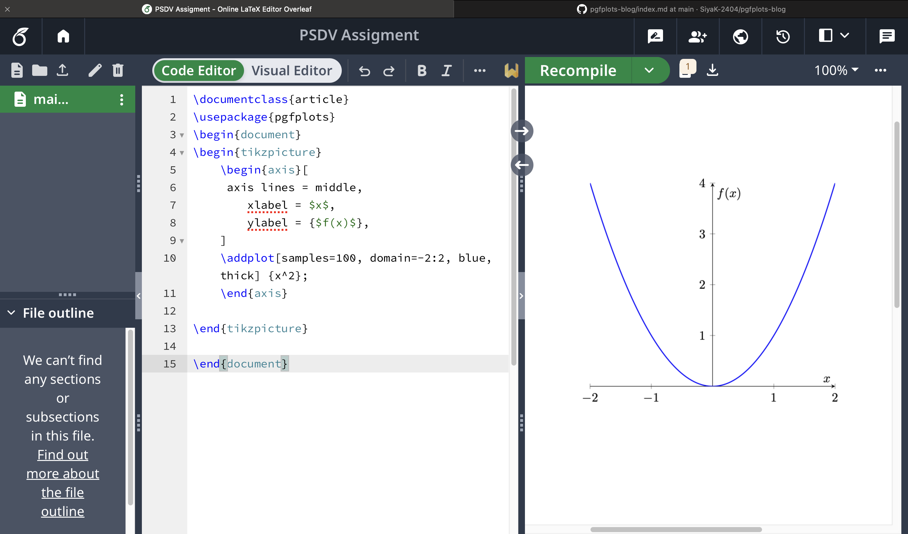
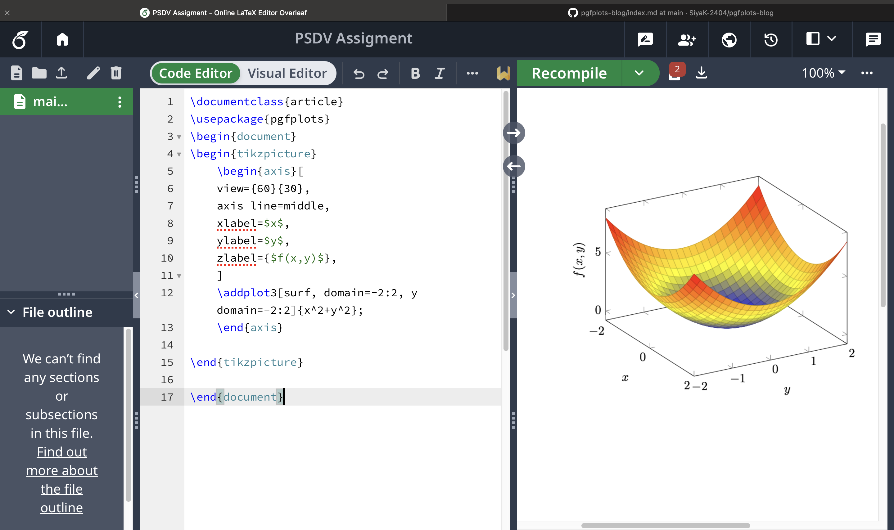

# PGFPlots in LaTeX
Creating High-Quality Plots in LaTeX with PGFPlots

## INTRODUCTION
PGFPlots is a powerful LaTeX package that revolutionizes the way we create plots in technical documents. Designed to integrate seamlessly with LaTeX, PGFPlots allows users to generate high-quality 2D and 3D plots directly within their documents, eliminating the need for external graphing software.
This versatile tool offers a wide range of plotting capabilities, from simple line graphs to complex 3D surfaces, all while maintaining the uniform formatting of LaTeX. Whether you're a researcher presenting data in a scientific paper, an engineer creating technical reports, or a student working on a thesis, PGFPlots provides the flexibility and precision needed to visualise your data effectively.
In this blog post, we'll explore the basics of PGFPlots, demonstrate its key features, and show you how to create professional-looking 2D and 3D plots that enhance the quality of your LaTeX documents


## INSTALLATION & SETUP
Here’s the stepwise guide for installing and setting up PGFPlots in LaTeX:
Installation & Setup Guide for PGFPlots


### 1. Install a LaTeX Distribution
- Download and install TeX Live (Windows/Linux/macOS) or MiKTeX (Windows) from their official websites.
- Ensure that the distribution includes pgfplots or install it separately.
Here are the official links to download TeX Live and MiKTeX:

TeX Live: ```https://tug.org/texlive/```

MiKTeX: ```https://miktex.org/```


### 2. Verify Installation
- Open a LaTeX editor such as TeXworks, Overleaf, or VS Code with LaTeX extensions.
- Run a simple document containing ``` \usepackage{pgfplots} ``` to check for errors.


### 3. Install PGFPlots (if not pre-installed)
- For MiKTeX:
 
    1. On Windows, search for "MiKTeX Console" in the Start menu and open it.
  
    2. Navigate to Packages (on the left sidebar).
  
    3. In the search bar, type pgfplots and press Enter.
  
    4. Select the package named pgfplots from the list.
  
    5. Click on Install to download and install PGFPlots.
  
    6. Wait for the installation to complete.

- For TeX Live:

     - Use the command
       ```latex
       tlmgr install pgfplots
       ```
- For Overleaf:

    - PGFPlots is pre-installed and ready to use.
    - Use the comman - \usepackage{pgfplots}


### 4. Enable PGFPlots in Your LaTeX Document

- Add the following line in the preamble of your document
  
  ```latex
  \usepackage{pgfplots}
  \pgfplotsset(compact=newest)
  ```

## KEY FEATURES-

PGFPlots offers a wide range of powerful features for creating high-quality plots directly within LaTeX documents. Here are some key capabilities:

### 2D and 3D Plotting
PGFPlots excels in creating both 2D and 3D plots with ease:

- 2D Plots: Supports various types of 2D plots, including line graphs, scatter plots, and bar charts.

- 3D Plots: Enables creation of surface plots, mesh plots, and contour plots in three dimensions.

### Plot Types
PGFPlots offers a diverse array of plot types to suit different data visualization needs:
- Line plots: For showing trends over continuous data
- Scatter plots: To display relationships between two variables
- Bar plots: For comparing discrete categories
- Area plots: To show cumulative totals over time
- Piecewise constant plots: For step functions or histograms
- Contour plots: To represent 3D surfaces on a 2D plane
- Quiver plots: For visualizing vector fields
- Polar axes: For circular or angular data representation
- Ternary diagrams: For three-variable compositional data
- Smith charts: Used in electrical engineering


## CUSTOMIZATION OPTIONS

PGFPlots provides extensive customization capabilities:

- Axes: Customize axis scales (linear, logarithmic), ticks, and gridlines
- Labels: Add and format axis labels, titles, and legends
- Colors: Apply custom color schemes to plots and elements
- Markers: Choose from various marker styles for data points
- Line styles: Adjust line thickness, style (solid, dashed, dotted)

By combining these features, PGFPlots enables users to create publication quality plots that seamlessly blend with their LaTeX documents, offering both flexibility and precision in data visualization.

## Code Examples
### Example 1: Simple 2D Plot
```latex
​​\documentclass{article}
\usepackage{pgfplots}
\begin{document}

\begin{tikzpicture}
    \begin{axis}[
      axis lines = middle,
        xlabel = $x$,
        ylabel = {$f(x)$},
    ]
    \addplot[samples=100, domain=-2:2, blue, thick] {x^2};
    \end{axis}
\end{tikzpicture}
\end{document}
```
Explanation of the code:

- Uses ```article``` class.
  
- Loads the ```pgfplots``` package.
  
- ``` tikzpicture``` environment, which is used for creating graphics using TikZ.
  
- ``` \begin(axis)```: begins axis environment for plotting.
  
- ``` axis lines = middle ```: Places the x-axis and y-axis at the center (instead of the default bottom-left).
  
- ``` xlabel = $x$``` : Labels the x-axis as x.
  
- ``` ylabel = {$f(x)$}```: Labels the y-axis as f(x).
  
- ``` \addplot[...] {x^2}```; plots the function f(x)=x^2.
  
- ``` samples=100``` : Uses 100 sample points for a smooth curve.
  
- ``` domain=-2:2``` : Plots the function from x=−2 to x=2.
  
- ``` blue, thick``` : Colors the curve blue and makes it thicker for better visibility.
  
- ``` \end(axis)``` and ``` \end(tikzpicture)``` closes environments.

Output: This creates a simple parabola f(x) = x^2 with labeled axes.


### Example 2: 3D Surface Plot
```latex
\documentclass{article}
\usepackage{pgfplots}
\begin{document}

\begin{tikzpicture}
    \begin{axis}[
        view={60}{30},
        axis lines = middle,
        xlabel = $x$,
        ylabel = $y$,
        zlabel = {$f(x,y)$}
    ]
    \addplot3[surf, domain=-2:2, y domain=-2:2] {x^2 + y^2}; 
    \end{axis}
\end{tikzpicture}

\end{document}
```
Explanation of the code:

- Uses ```article``` class.
  
- Loads the ```pgfplots``` package.

- ``` tikzpicture``` starts a drawing environment where we define and draw the plot.

- ``` \begin{axis}``` initializes the 3D coordinate system.

- ``` view={60}{30}``` sets the viewing angle
  - The first value (60) is the rotation around the vertical axis.
  - The second value (30) tilts the plot.
  
- ``` axis lines = middle``` places the axis lines in the middle of the graph.

- ``` xlabel = $x$, ylabel = $y$, zlabel = {$f(x,y)$} ``` define the labels for the axes.

- ``` \addplot3``` is used for 3D plotting.

- ``` surf ```specifies that the function should be drawn as a surface plot.

- ``` domain=-2:2, y domain=-2:2 ```defines the range of x and y from -2 to 2.

- ``` {x^2 + y^2} ```is the function being plotted.

Output: This generates a 3D surface plot for f(x,y)=x^2+y^2



## USE-CASE

### Use Cases for PGFPlots in LaTeX

PGFPlots is a versatile tool that finds applications in various fields where data visualization is crucial. Here are some key use cases:

### Scientific Papers
Researchers can create publication-quality plots directly within their LaTeX documents. This ensures consistency in typography and style throughout the paper. PGFPlots is particularly useful for:
- Presenting experimental data with error bars
- Plotting mathematical functions and equations
- Creating scatter plots for data analysis

### Technical Reports
Engineers and technical professionals can utilize PGFPlots to:
- Generate precise graphs for system performance analysis
- Create bar charts for comparing different parameters or results
- Produce logarithmic plots for data spanning multiple orders of magnitude

### Academic Theses
Graduate students can benefit from PGFPlots in their dissertations by:
- Visualizing complex datasets collected during research
- Creating custom plots that may not be easily achievable with other software
- Ensuring consistency across all figures in the thesis

### Data Visualization in Presentations
PGFPlots can be used with LaTeX beamer class to create:
- Interactive plots for slideshows
- Animated graphs to show data trends over time
- Clear, high-resolution figures that scale well on different display sizes

### Educational Materials
Educators can leverage PGFPlots to:
- Illustrate mathematical concepts with precise, customized graphs
- Create visual aids for textbooks and lecture notes
- Demonstrate data analysis techniques with real-world examples

By integrating seamlessly with LaTeX, PGFPlots allows users to create high-quality, customizable plots that enhance the visual appeal and clarity of their documents across various academic and professional fields.

## CONCLUSION

PGFPlots is an incredibly useful tool for anyone working with LaTeX, especially when it comes to creating professional, well-formatted plots. Instead of relying on external software for graphs, it allows users to generate high-quality 2D and 3D visualizations directly within their documents. This not only ensures consistency but also makes the entire workflow smoother for researchers, engineers, and students.
While it takes some time to get familiar with the syntax, the level of control and customization it offers makes the effort worthwhile. Whether you need simple line plots or complex 3D surfaces, PGFPlots provides a flexible and reliable solution. With practice, it becomes an essential skill for anyone working on scientific papers, technical reports, or academic projects.


## REFERENCES
 
- PGFPlots Manual: The comprehensive official documentation is available online and regularly updated.
- PGFPlots GitHub Repository: The source code and latest development updates can be found here.
Overleaf PGFPlots Guide: An excellent resource for beginners, with interactive examples and explanations4.
- LaTeX Sparkle Project: Offers tips and examples for using PGFPlots effectively.
- TikZ and PGF Manual: Since PGFPlots is based on TikZ, this manual provides valuable background information.
- TeX StackExchange: A community-driven Q&A platform where you can find solutions to specific PGFPlots problems.
- "LaTeX Cookbook" by Stefan Kottwitz: A book that includes a chapter on creating graphs with PGFPlots.
- CTAN PGFPlots Page: The official package repository with download links and basic information.

These resources cover a wide range of topics, from basic usage to advanced techniques, ensuring you can make the most of PGFPlots in your LaTeX documents.


## CITATIONS

- https://tikz.dev/pgfplots/
- https://www.wikitechy.com/tutorials/latex/plots-in-latex
- https://github.com/LogCreative/PGFPlotsEdt
- https://www.overleaf.com/learn/latex/Pgfplots_package
- https://github.com/pgf-tikz/pgfplots
- https://ctan.org/tex-archive/graphics/pgf/contrib/pgfplots?lang=en
- https://pgfplots.sourceforge.net/gallery.html
- https://latex-tutorial.com/tutorials/pgfplots/
- https://pgfplots.net
- https://github.com/gorakhargosh/graphbook/blob/master/style/latex/pgfplots/pgfplots.sty
- https://ctan.org/pkg/pgfplots?lang=en
- https://www.reddit.com/r/LaTeX/comments/kr9hst/tutorial_plot_functions_and_data_in_latex_using/
- https://www.overleaf.com/latex/examples/the-simple-pgfplot-example/yygbmyhnkqdx
- https://jackypacky.github.io/pgf-econ-graphs/guide.pdf
- https://pgfplots.sourceforge.net/pgfplots.pdf
- https://www.youtube.com/watch?v=bc3OeEsijN8
- https://tikz.dev/pgfplots/reference-2dplots
- https://github.com/jviquerat/latex
- https://tex.stackexchange.com/questions/511078/pgfplot-tikz-plot-creation
- https://www.youtube.com/watch?v=NQj87uFm-_s


 
